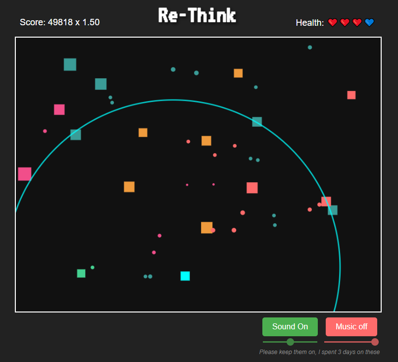

# Re-Think

**Play the game live here:** [https://f-mangini.github.io/Arcade-Game/](https://f-mangini.github.io/Arcade-Game/)

## Developer Note

**Please Note:** This game originated as an experimental project and was never intended to be a fully polished product. As a result, the codebase is quite rushed and may lack optimal structure or comments. It served primarily as a creative and learning exercise, but also as an occasion to test some tools and have fun with friends.

---

## About The Game

Re-Think is a challenging, rogue-like 2D arcade shooter where survival is key. Navigate your square within a confined arena, dodging relentless enemy fire and eliminating diverse foes.

## Gameplay Features

*   **Limited Arena:** Both the player and enemies are restricted to a specific play area, demanding precise movement and spatial awareness.
*   **Diverse Enemies:** Face a variety of enemies with different characteristics:
    *   **Movement:** Ranging from slow to fast.
    *   **Shooting:** Bullets vary in range, spread, size, and speed. Enemies may fire single shots or rapid bursts.
    *   **Behavior:** Some enemies teleport randomly (but never directly onto the player), while others specialize in attacking from specific ranges (close-up or distant).
*   **Increasing Difficulty:** The challenge ramps up continuously as your score increases – enemies become tougher and more numerous.
*   **Health System:** You start with three hearts. Each hit costs one heart. Survive for a period without taking damage to regenerate a lost heart.
*   **Power-Ups:** Grab temporary power-ups to gain an advantage:
    *   **Slow-Mo:** Slows down time, making dodging easier.
    *   **Shield:** Provides temporary protection from enemy bullets.
    *   **Invincibility:** Makes you immune to damage for a short duration.
    *   **Life:** Instantly grants an extra heart (up to the maximum).
    *   **Hack:** Disables enemy bullets and shooting.
*   **Retro Aesthetics:** Simple geometric shapes and a vibrant color palette create a distinct arcade feel.

## How to Play

*   **Movement:** Use the `WASD` keys to move your player square.
    *   `W`: Move Up
    *   `A`: Move Left
    *   `S`: Move Down
    *   `D`: Move Right
*   **Objective:** Survive as long as possible and gain achivements.

## Contributing

This is an open-source project. While the code structure reflects its experimental origins (see Developer Note above), feel free to explore it, suggest improvements, or report issues if you wish!
